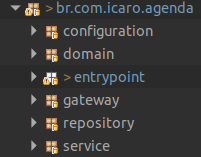
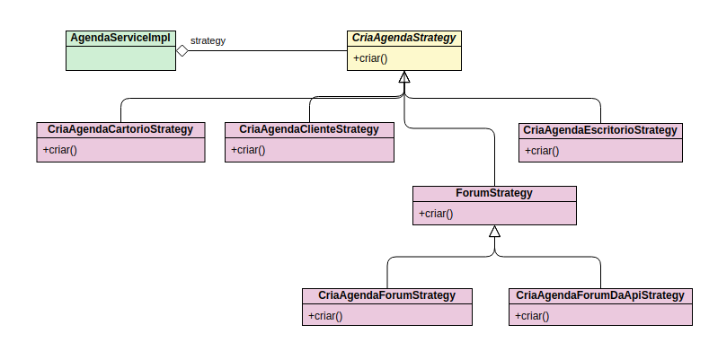
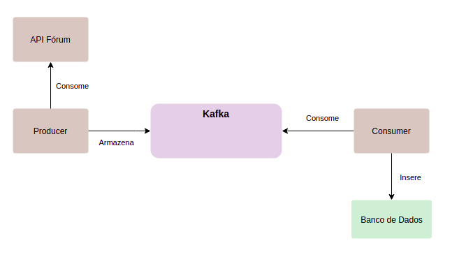

# Agenda API

Aplicação desenvolvida com Springbooot

### Tecnologias
- `Java 11`
- `Springboot 2.3.3`
- `Spring Data JPA`
- `H2 Database`
- `Lombok`
- `Swagger`
- `Maven`
- `Junit`
- `Mockito`

Estrutura dos packages

- `Configuration` - Encontra-se as classes de configuração da aplicação. Ex: Configuração de Cors, Swagger.
- `domain` - Contém as classes de domínio do negócio
- `entrypoint` - Ponto de entrada para o sistema, pode ser REST endpoints, Jobs.
- `gateway` - Faz a interface com sistemas externos
- `Repository` - Classes que fazem interface com os dados, buscam e armazenam informações
- `Service` - Classes de serviços

Para a criação da agenda foi utilizado o padrão strategy, pois para cada tipo de agenda o seu padrão de criação muda.

A única particularidade é em relação ao strategy do fórum. O fórum possui dois strategy, o `CriaAgendaForumStrategy` tem a responsabilidade de criar a agenda no sistema e na api do fórum, já o `CriaAgendaForumDaApiStrategy` tem a responsabilidade de criar no sistema as agendas obtidas da api do fórum.

### Scheduler Springboot

Para a criação de agendas oriundas da api do fórum de tempos em tempos foi utilizado o recurso Scheduler do springboot. O Job está configurado para ser executado
de 1 em 1 minuto. O scheduler está no package `br.com.icaro.agenda.entrypoint.scheduler`

### Arquitetura com Kafka

Para garantir que todas as agendas entrem no sistema o modelo de arquitetura com kafka é apresentado. O kafka é uma plataforma distribuída de streaming que consegue processar uma grande quantidade de dados e entregá-los em tempo real aos seus consumidores.

De tempos em tempos o producer consome a api do fórum e armazena seus dados no kafka. O consumer de tempos em tempos consome os dados no kafka e armazena-os na base de dados.

### Execução da Aplicação

- Prerequisitos
  - `Java JDK 11`
  - `Maven`

Execute o maven para buildar o projeto

`mvn clean install`

Execute a aplicação

`mvn spring-boot:run`

A `API` estarará executando na porta `8080`

Acesse `localhost:8080/swagger-ui.html` para vê a documentação swagger.
