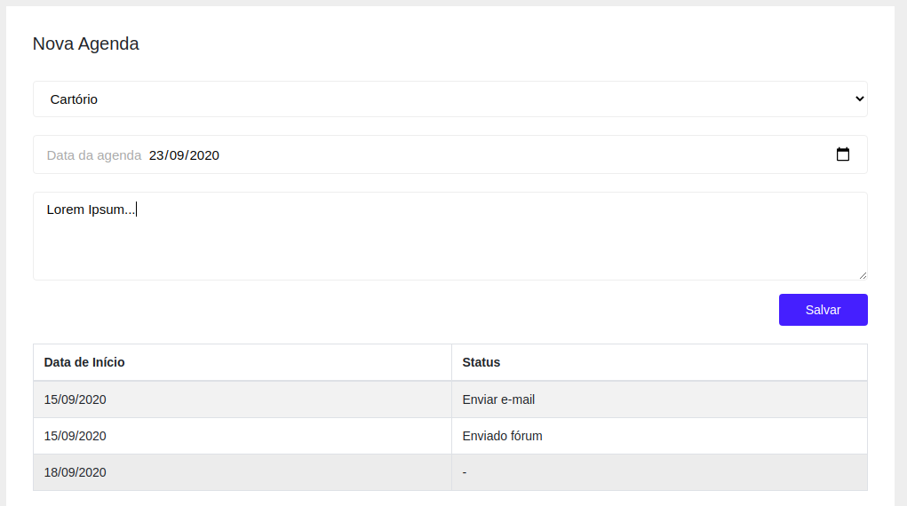
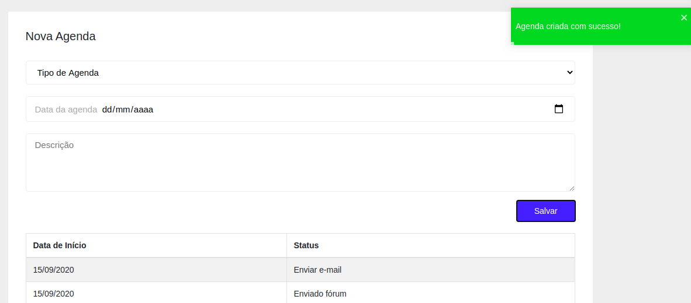

# Agenda Web 

Aplicação desenvolvida com React

### Tecnologias
- `React`
- `Styled Components`
- `React Bootstrap`
- `Axios`

### Screenshots

Cadastro e listagem

Agenda criada

### Execução da Aplicação

Antes de iniciar a aplicação web certifique-se de executar o [backend](https://github.com/icaromagnago/react-springboot-agenda/tree/master/agenda-api)

- Prerequisitos
  - Nodejs instalado

Execute

`yarn install` e depois `yarn start`

Acesse [http://localhost:3000](http://localhost:3000)

